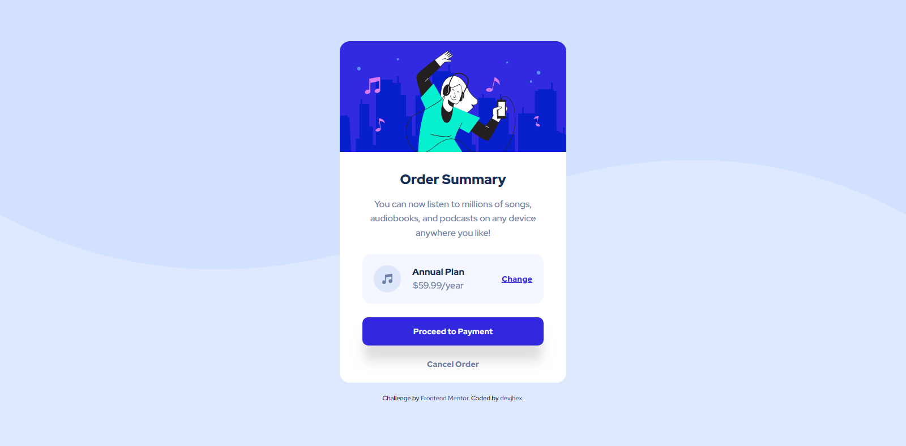

# Frontend Mentor - Order summary card solution

This is a solution to the [Order summary card challenge on Frontend Mentor](https://www.frontendmentor.io/challenges/order-summary-component-QlPmajDUj). Frontend Mentor challenges help you improve your coding skills by building realistic projects. 

## Table of contents

- [Overview](#overview)
  - [The challenge](#the-challenge)
  - [Screenshot](#screenshot)
  - [Links](#links)
- [My process](#my-process)
  - [Built with](#built-with)
  - [Useful resources](#useful-resources)
- [Author](#author)

## Overview

### The challenge

Users should be able to:

- See hover states for interactive elements

### Screenshot

### Links
- [Live Site](https://devjhex-order-summary-component-main.vercel.app/)
- [Solution](https://www.frontendmentor.io/solutions/responsive-ordersummarycard-using-flexbox-7BvR05jXxY)

## My process

### Built with

- Semantic HTML5 markup
- CSS custom properties
- Flexbox
- Mobile-first workflow

### What I learned

Planning the markup for your project is the perfect way to start and approach a project because it makes it so easy to work out and implement which is the opposite when you just dive into code without planning.

### Useful resources

- [The box shadow generator](https://www.cssmatic.com/box-shadow) - This helped me to easily get a box shadow for a part of the component which i highly recommend.
- [MDN](https://developer.mozilla.org/en-US/) - This is an amazing site for references for all the properties used in css and many other things that i highly recommend.

## Author
- Frontend Mentor - [@Dev-Jhex](https://www.frontendmentor.io/profile/Dev-Jhex)
- Twitter - [@devJhex](https://www.twitter.com/devJhex)
